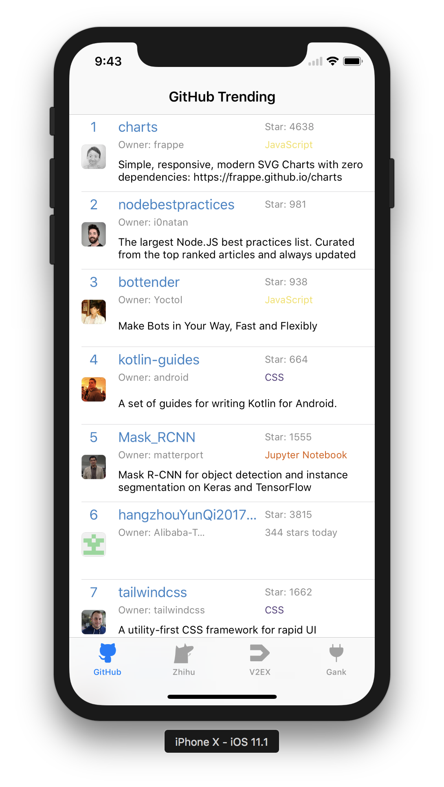

# DeveloperHit

   

After exploring some Web APIs associated with the chosen topic, only a few websites provide friendly APIs, especially when an XML format data response is expected. Therefore we decided to build our own APIs by parsing HTML pages responded from target websites:

- Github

  Github trending exhibits some potential open source projects, however, there are only APIs for specific repository and user. So we will build an unofficial XML-based backend.
- V2EX

  V2EX is a community about technology and design. It provides some APIs for getting latest posts.
- Gank

  Gank.io is a website which provides some interesting frameworks and projects for programmers. Thus, it also pushes some news in software engineering.
- Zhihu

  Zhihu may be the biggest Q&A community in China. We will write a backend with RESTful API, which providing some development-related topic content.

The frontend will integrate lastest and hot information in a list for users. And I plan to implement it on  Web, iOS and Android platform.

## Backend

| Content | URL                                      |
| ------- | ---------------------------------------- |
| GitHub  | http://115.159.1.222:8000/github         |
| Zhihu   | http://115.159.1.222:3001/topic          |
| V2EX    | https://www.v2ex.com/api/topics/hot.json |
| Gank    | http://gank.io/api/day/2015/08/07        |

### GitHub

#### How to Run

```shell
go get github.com/zjzsliyang/go-trending
cd DeveloperHit/Backend
go build
./Backend
```

It will run in the ``8000`` port with the url  ``/github``.

### Zhihu

Repo: https://github.com/lisirrx/ZhihuApiBackend

#### How to Run

```shell
npm install
npm start
```

It will run in the ``3001`` port with the url  ``/topic``.

## Frontend

### Web

Repo:  https://github.com/lisirrx/vue-DeveloperHit

### iOS

#### Screenshot



### Android

under construction